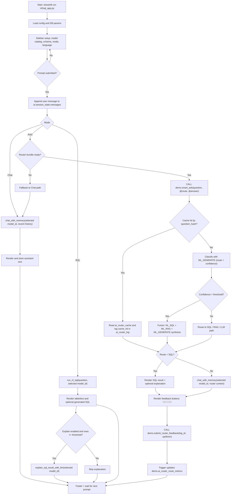

```mermaid
flowchart TD
    A["Start: streamlit run nl2sql_app.py"] --> B["Load config and DB params"]
    B --> C["Sidebar setup: model catalog, schema, mode, language"]
    C --> D{"Prompt submitted?"}
    D -- "No" --> C
    D -- "Yes" --> E["Append user message to st.session_state.messages"]

    E --> F{"Mode"}

    F -- "Chat" --> G["chat_with_memory(selected model_id, recent history)"]
    G --> H["Render and store assistant text"]

    F -- "SQL" --> I["run_nl_sql(question, selected model_id)"]
    I --> J["Render table/text and optional generated SQL"]
    J --> K{"Explain enabled and rows <= threshold?"}
    K -- "Yes" --> L["explain_sql_result_with_llm(selected model_id)"]
    K -- "No" --> M["Skip explanation"]

    F -- "Auto" --> N{"Router bundle ready?"}
    N -- "No" --> O["Fallback to Chat path"]
    O --> G
    N -- "Yes" --> P["CALL demo.smart_ask(question, @route, @answer)"]

    P --> Q{"Cache hit by question_hash?"}
    Q -- "Yes" --> R["Read ai_router_cache and log cache_hit in ai_router_log"]
    Q -- "No" --> S["Classify with ML_GENERATE (route + confidence)"]
    S --> T{"Confidence < threshold?"}
    T -- "Yes" --> U["Fusion: NL_SQL + ML_RAG + ML_GENERATE synthesis"]
    T -- "No" --> V["Route to SQL / RAG / LLM path"]

    R --> W{"Route = SQL?"}
    U --> W
    V --> W

    W -- "Yes" --> X["Render SQL result + optional explanation"]
    W -- "No" --> Y["chat_with_memory(selected model_id, router context)"]
    X --> Z["Render feedback buttons: 👍🏻 / 👎🏻"]
    Y --> Z

    Z --> AA["CALL demo.submit_router_feedback(log_id, up/down)"]
    AA --> AB["Trigger updates demo.ai_router_route_metrics"]

    H --> AC["Footer + wait for next prompt"]
    L --> AC
    M --> AC
    J --> AC
    AB --> AC
```
